# TaskFlow AI - Intelligent Project Management for ERPNext

> Transform your ERPNext project management with AI-powered task automation, dynamic template systems, and intelligent lead-to-project conversion workflows.

[](https://opensource.org/licenses/MIT)
[](https://github.com/frappe/erpnext)
[](https://github.com/frappe/frappe)

## 🚀 Quick Installation

```bash
# Install TaskFlow AI in your ERPNext instance
bench get-app https://github.com/yourusername/taskflow_ai.git
bench --site your-site-name install-app taskflow_ai
bench --site your-site-name migrate
```

## 🎯 Key Features

### 🤖 AI-Powered Task Management
- **Smart Task Assignment**: AI recommends optimal team members based on skills, workload, and performance
- **Intelligent Duration Prediction**: Machine learning models predict realistic task completion times
- **Employee Skill Matching**: Advanced skill profiling system for precise task assignments
- **Workload Optimization**: Automatic workload balancing across team members

### 📋 Dynamic Template System
- **Task Template Groups**: Organize templates into logical groups for different project types
- **Dynamic Relationships**: Link templates to groups with flexible sequence management
- **Project Generation**: Create complete projects from template groups with one click
- **Customizable Workflows**: Adapt templates for your specific business processes

### 🔄 Enhanced Lead Management
- **Project Planning Workflow**: Manual control over lead-to-project conversion
- **Review & Approval Process**: Structured approval workflow for project managers
- **Lead Intelligence**: Advanced lead segmentation and scoring system
- **Automated Data Population**: Smart form filling from lead information

### 📊 Advanced Analytics
- **Performance Insights**: Track team performance, task completion rates, and project success
- **Skill Analytics**: Monitor skill development and identify training needs
- **Project Forecasting**: Predict project timelines and resource requirements
- **Department Intelligence**: Optimize departmental workflows and assignments

## 🏗️ System Architecture

### DocType Structure
```
### Core Components

#### 1. AI Task Assignment System
- **AI Task Profile**: Define skill requirements and complexity levels
- **Employee Skills**: Comprehensive skill profiling with experience levels
- **Smart Matching Algorithm**: ML-powered assignment recommendations
- **Performance Feedback Loop**: Continuous learning from assignment outcomes

#### 2. Dynamic Template Management
- **Task Templates**: Reusable task definitions with metadata
- **Template Groups**: Logical grouping of related templates
- **Sequence Management**: Flexible ordering within template groups
- **Project Generation**: Automated project creation from templates

#### 3. Enhanced Project Planning
- **Project Planning DocType**: Comprehensive planning document
- **Approval Workflow**: Draft → Under Review → Approved → Submitted
- **Lead Integration**: Seamless conversion from leads to planned projects
- **Timeline Estimation**: Automatic scheduling based on template data

### Technical Stack
- **Backend**: Python with Frappe Framework
- **Frontend**: JavaScript with Frappe's UI components
- **Database**: MariaDB with optimized queries
- **AI/ML**: Scikit-learn for assignment algorithms
- **Integration**: Deep ERPNext integration

## 📚 Usage Guide

### Setting Up Task Templates

1. **Create Task Templates**
   ```
   Navigate to: Task Template > New
   - Define task details, duration, and requirements
   - Set skill requirements and complexity
   - Add to appropriate template groups
   ```

2. **Configure Template Groups**
   ```
   Navigate to: Task Template Group > New
   - Create logical groupings (e.g., "Website Development", "ERP Implementation")
   - Templates can be dynamically added/removed from groups
   ```

### Lead to Project Conversion

1. **Enhanced Lead Management**
   ```
   - Leads automatically create Project Planning documents
   - Manual review and approval process
   - Rich planning interface with budget and timeline
   ```

2. **Project Creation**
   ```
   - Select template group for project type
   - System generates complete project structure
   - Tasks automatically assigned based on skills
   ```

### AI Task Assignment

1. **Configure Employee Skills**
   ```
   Navigate to: Employee > Skills Tab
   - Add relevant skills with proficiency levels
   - System learns from assignment feedback
   ```

2. **Set Up AI Task Profiles**
   ```
   Navigate to: AI Task Profile > New
   - Define skill requirements for task types
   - Set complexity and priority levels
   ```

## 🔧 Configuration

### Required Setup

1. **Employee Skills Configuration**
   - Configure employee skill profiles
   - Set proficiency levels (Beginner, Intermediate, Advanced, Expert)
   - Regular skill assessment and updates

2. **Department Intelligence**
   - Set up department-specific workflows
   - Configure department lead assignments
   - Optimize departmental task distribution

3. **Lead Segment System**
   - Configure lead scoring criteria
   - Set up segment-based routing
   - Automate lead qualification process

### Optional Enhancements

1. **Custom Task Categories**
   - Define business-specific task types
   - Create custom skill requirements
   - Set up industry-specific templates

2. **Performance Analytics**
   - Configure KPI tracking
   - Set up automated reporting
   - Enable performance dashboards

## 🚀 Advanced Features

### Machine Learning Capabilities
- **Predictive Task Duration**: ML models learn from historical data
- **Assignment Optimization**: AI considers multiple factors for optimal assignments
- **Performance Prediction**: Forecast project success probability
- **Risk Assessment**: Identify potential bottlenecks and risks

### Integration Points
- **CRM Integration**: Seamless lead management workflow
- **HR Integration**: Employee skill and performance tracking
- **Project Management**: Complete project lifecycle management
- **Reporting**: Advanced analytics and business intelligence

### API Endpoints
```python
# Get AI task assignment recommendations
taskflow_ai.api.get_task_assignment_recommendations(task_id, filters)

# Generate project from template group
taskflow_ai.api.create_project_from_template_group(planning_id, group_name)

# Get employee skill analysis
taskflow_ai.api.get_employee_skill_analysis(employee_id)

# Validate lead conversion eligibility
taskflow_ai.api.validate_lead_conversion_eligibility(lead_id)
```

## 🔍 Troubleshooting

### Common Issues

1. **Assignment Algorithm Not Working**
   - Verify employee skills are properly configured
   - Check AI Task Profile requirements
   - Ensure sufficient employee pool for assignment

2. **Template Group Issues**
   - Verify template group relationships
   - Check template sequence ordering
   - Validate template completeness

3. **Lead Conversion Problems**
   - Check lead status and qualification
   - Verify project planning workflow
   - Ensure proper permissions

### Debug Mode
```bash
# Enable detailed logging
bench --site your-site-name set-config developer_mode 1

# Check system status
bench --site your-site-name execute taskflow_ai.api.system_monitor.quick_system_check
```

## 🤝 Contributing

1. Fork the repository
2. Create your feature branch (`git checkout -b feature/amazing-feature`)
3. Commit your changes (`git commit -m 'Add amazing feature'`)
4. Push to the branch (`git push origin feature/amazing-feature`)
5. Open a Pull Request

## 📄 License

This project is licensed under the MIT License - see the [LICENSE](license.txt) file for details.

## 🆘 Support

- **Documentation**: [Full Documentation](https://github.com/yourusername/taskflow_ai/wiki)
- **Issues**: [GitHub Issues](https://github.com/yourusername/taskflow_ai/issues)
- **Discussions**: [GitHub Discussions](https://github.com/yourusername/taskflow_ai/discussions)

## 🏆 Acknowledgments

- Built on the powerful [Frappe Framework](https://github.com/frappe/frappe)
- Integrates seamlessly with [ERPNext](https://github.com/frappe/erpnext)
- Inspired by modern AI-driven project management methodologies

---

**Made with ❤️ for the ERPNext Community**
```

### Workflow Overview

```mermaid
graph TD
    A[Salesperson creates Lead] --> B[Lead status → Interested]
    B --> C[AI triggers project generation]
    C --> D[Select template: ERPNext Implementation]
    D --> E[AI generates task hierarchy]
    E --> F[Predict durations & risks]
    F --> G[Recommend assignees]
    G --> H[Build optimized schedule]
    H --> I[Team review & approval]
    I --> J[Execute & learn]
```


## 🚀 Installation

### Prerequisites
- Frappe Framework v15+
- ERPNext v15+
- Python 3.8+

### Quick Install
```bash
# 1. Get the app
cd ~/frappe-bench/apps
git clone https://github.com/your-repo/taskflow_ai.git

# 2. Install in your site
bench --site your-site.local install-app taskflow_ai

# 3. Run the setup script
./apps/taskflow_ai/install.sh your-site.local
```

### Manual Setup (if needed)
```bash
# Install app
bench --site your-site.local install-app taskflow_ai

# Run migrations
bench --site your-site.local migrate

# Install sample templates
bench --site your-site.local execute taskflow_ai.install_templates.install_sample_templates
```

## 📚 Quick Start Guide

### 1. Review Default Templates
Navigate to **TaskFlow AI > Task Template** to see the pre-installed ERPNext implementation workflow:

- **Pre-Sales**: Discovery call, requirements gathering, demo, proposal
- **Implementation**: Kickoff, system setup, module configurations  
- **Customization**: Gap analysis, custom development, workflows, reports
- **Go-Live**: Training, UAT, data migration, hypercare support

### 2. Test Lead Conversion
1. Create a new **Lead** in ERPNext
2. Set status to **"Interested"**
3. System will prompt: *"Generate AI project for this lead?"*
4. Select template group and confirm
5. Watch as AI creates complete project with intelligent task assignments!

### 3. Explore AI Predictions
Open any generated task to see:
- **Predicted Duration**: 12.5h (P80: 15h)
- **Risk Assessment**: 25% slip probability
- **Top Assignees**: Ranked by fit score with reasoning
- **Confidence Score**: 82% prediction confidence

## 🔧 Configuration

### Template Customization
Create custom templates for your specific services:

```python
# Example: Custom API Integration Template
template = {
    "template_name": "Third-party API Integration",
    "category": "Customization",
    "default_duration_hours": 16,
    "ai_complexity_score": 0.8,
    "required_skills": [
        {"skill": "Python Development", "required_level": "4"},
        {"skill": "API Integration", "required_level": "5"}
    ]
}
```

### Employee Skills Setup
Define skills and levels for accurate AI assignments:
1. Go to **HR > Employee**
2. Add skills with proficiency levels (1-5)  
3. AI will use this for optimal task assignments

### Automation Settings
Configure auto-trigger conditions:
```python
# Lead status triggers
"Lead.status == 'Interested'"

# Opportunity triggers  
"Opportunity.status == 'Quotation'"
```

## 📊 API Reference

### Core Endpoints

#### Get AI Recommendations
```python
# GET /api/method/taskflow_ai.api.get_task_ai_recommendations
{
    "task_name": "TASK-001"
}
```

#### Create Project from Template
```python  
# POST /api/method/taskflow_ai.api.create_project_from_template
{
    "template_group": "ERPNext Implementation",
    "project_name": "ABC Corp Implementation",
    "customer": "ABC Corporation"
}
```

#### Dashboard Data
```python
# GET /api/method/taskflow_ai.api.get_dashboard_data
# Returns: project counts, accuracy metrics, risk analysis
```

### Automation Hooks
```python
# hooks.py
doc_events = {
    "Lead": {
        "on_update": "taskflow_ai.ai.automation.on_lead_update"
    },
    "Task": {
        "after_insert": "taskflow_ai.ai.pipeline.on_task_created"
    }
}
```

## 📈 Sample ERPNext Implementation Workflow

Our default template includes **21 tasks** across **4 phases**:

### Phase 1: Pre-Sales (4 tasks, ~20 hours)
- Initial Discovery Call (2h)
- Requirements Gathering (8h)  
- Product Demo (4h)
- Proposal Creation (6h)

### Phase 2: Implementation (7 tasks, ~72 hours)
- Project Kickoff (2h)
- Instance Setup (4h)
- CRM Configuration (8h)
- Accounts Setup (12h)
- Inventory Management (10h)
- HR & Payroll (14h) 
- Manufacturing Module (16h)

### Phase 3: Customization (5 tasks, ~64 hours)
- Gap Analysis (6h)
- Custom Fields/DocTypes (12h)
- Workflow Automation (16h)
- Reports & Dashboards (10h)
- API Integrations (20h)

### Phase 4: Go-Live (5 tasks, ~96 hours)
- User Training (16h)
- UAT Execution (24h)
- Data Migration (20h)
- Go-Live Support (32h)
- Post-Live Hypercare (24h)

**Total Estimated Duration**: 252 hours (~6-8 weeks)

## 🧠 AI Models & Learning

### Duration Prediction
- **Model**: LightGBM Regressor
- **Features**: Task complexity, assignee skills, project context, historical data
- **Accuracy Target**: <15% Mean Absolute Error
- **Output**: Duration estimate + confidence intervals (P50, P80, P95)

### Risk Assessment  
- **Model**: XGBoost Classifier
- **Output**: Slip probability (0-100%)
- **Factors**: Dependencies, workload, timeline pressure, complexity

### Assignee Ranking
- **Model**: Learning-to-Rank (LambdaMART)
- **Ranking Factors**: Skill match, availability, performance history, workload
- **Output**: Ranked list with fit scores and reasoning

### Continuous Learning
- **Training Frequency**: Weekly automatic retraining
- **Feedback Integration**: User ratings improve recommendations
- **Performance Monitoring**: Drift detection and accuracy tracking

## 🎯 Success Metrics

### Operational KPIs
- **Prediction Accuracy**: Target <15% MAE on duration estimates
- **On-time Delivery**: >85% of tasks completed by predicted date  
- **Resource Utilization**: 75-85% optimal range
- **Schedule Conflicts**: <10% requiring manual intervention

### Business Impact
- **Project Setup Time**: 2 days → 30 minutes (95% reduction)
- **Delivery Predictability**: Improved customer satisfaction
- **Team Satisfaction**: Balanced workloads, reduced overtime
- **Revenue Impact**: Faster project starts, better resource planning

## 🔒 Security & Privacy

- **Role-based Access**: Predictions visible based on user permissions
- **Data Anonymization**: Training data can be anonymized for privacy
- **Audit Trail**: All AI decisions are logged and traceable
- **GDPR Compliance**: Personal data handling follows regulations

## 🤝 Contributing

We welcome contributions! Please see [CONTRIBUTING.md](CONTRIBUTING.md) for guidelines.

### Development Setup
```bash
# Clone and setup development environment
git clone https://github.com/your-repo/taskflow_ai.git
cd taskflow_ai

# Install in development mode
bench get-app --branch develop https://github.com/your-repo/taskflow_ai.git
```

### Testing
```bash
# Run tests
bench --site test-site run-tests --app taskflow_ai
```

## 📄 License

This project is licensed under the MIT License - see the [LICENSE](license.txt) file for details.

## 🆘 Support

- **Documentation**: [Wiki](https://github.com/your-repo/taskflow_ai/wiki)
- **Issues**: [GitHub Issues](https://github.com/your-repo/taskflow_ai/issues)
- **Discussions**: [GitHub Discussions](https://github.com/your-repo/taskflow_ai/discussions)
- **Email**: sammish.thundiyil@gmail.com

## 🚀 What's Next?

### Roadmap
- [ ] **Advanced ML Models**: Deep learning for better predictions
- [ ] **NLP Integration**: Auto-generate tasks from requirement documents  
- [ ] **Mobile App**: TaskFlow AI mobile companion
- [ ] **Integrations**: Slack, Teams, Jira connectors
- [ ] **Advanced Analytics**: Predictive project health dashboards

---

**Transform your ERPNext projects with AI. Stop counting hours, start delivering outcomes.** 🎯🤖

*Built with ❤️ for the ERPNext community*

### Installation

You can install this app using the [bench](https://github.com/frappe/bench) CLI:

```bash
cd $PATH_TO_YOUR_BENCH
bench get-app $URL_OF_THIS_REPO --branch develop
bench install-app taskflow_ai
```

### Contributing

This app uses `pre-commit` for code formatting and linting. Please [install pre-commit](https://pre-commit.com/#installation) and enable it for this repository:

```bash
cd apps/taskflow_ai
pre-commit install
```

Pre-commit is configured to use the following tools for checking and formatting your code:

- ruff
- eslint
- prettier
- pyupgrade

### CI

This app can use GitHub Actions for CI. The following workflows are configured:

- CI: Installs this app and runs unit tests on every push to `develop` branch.
- Linters: Runs [Frappe Semgrep Rules](https://github.com/frappe/semgrep-rules) and [pip-audit](https://pypi.org/project/pip-audit/) on every pull request.


### License

mit
